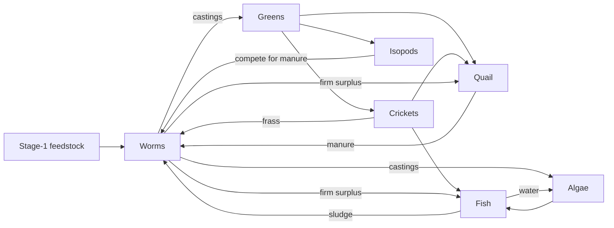

# Cascade growth graph (Stage 4 planning)

A weekly, multi-species population graph for the Loop cascade. It is research code. **Stage 1 worms remain the only active spend.** Quail here is Stage 4 planning. Fish is Stage 5 planning. Nothing in this folder authorizes a purchase of insects, greens, algae, birds, or tanks.

The capital order is still [`../../biology/CASCADE.md`](../../biology/CASCADE.md): worms → crickets and isopods → greens and algae → quail → aquaponics. Breed floors and firm offtake use [`../synergy/circular_buffers.py`](../synergy/circular_buffers.py) (`breed_floor`, `safe_sell_limit`). Quail eggs, hatch, the 1♂:3♀ breeder practice, and weekly mortality are the constants in [`../quail/quail_model.py`](../quail/quail_model.py). This graph does not re-solve Grit kit caps or the prepaid price. Those stay in the quail model.

| File | Role |
|------|------|
| `model.py` | Stage chains, sex where it matters, stochastic draws, feed and manure links |
| `plots.py` | Dependency graph and trajectory figures |
| `smoke.py` | One command that regenerates the figures and checks the couplings |
| `results/` | `cascade_growth_smoke.json`, including the tagged parameter list |

```bash
cd research/cascade_growth
python3 smoke.py
```

Figures land in [`../plots/`](../plots/README.md):

| Plot | What it shows |
|------|----------------|
| `cascade_dependency_graph.png` | Stages and the arrows between them. Thicker arrows are larger median flows in the 1♂:3♀ run. |
| `cascade_trajectories.png` | Median and P10 for that run. Seed `20260928`, 40 paths. |
| `cascade_sex_ratio_sensitivity.png` | The same 16 founders as 1♂:3♀ or as 3♂:1♀, and the phase of hens against greens. |

## What is sex, and what is a stage

Quail and fish breeders are male and female. Hatch sex for quail is the quail-model fraction (about half). The stocking ratio is a separate choice: new males are recruited only up to one male per three hens, and extra founding males do not cause the model to add hens. Worms are hermaphrodites, tracked as cocoon, juvenile, and breeder headcount with a body mass. Crickets, isopods, greens, and algae have no binary sex. Crickets move egg → nymph → adult. Isopods move juvenile → adult. Greens are seedling and canopy. Algae is one biomass pool.

## Noise and the two percentiles

Each path has its own random stream: `Random(seed + path_index * 10007)`. Default seed is `20260928`.

Survival and hatch use binomial draws (a normal approximation above 80 individuals). Recruits use Poisson draws (same approximation above 40). Fecundity uses a lognormal multiplier whose median is 1, so the deterministic rate is the median rate. Worm fecundity uses the ops-dashboard weekly sigma of 0.015, which is why the worm band is narrow.

**P10** on a figure is the 10th percentile of paths at that week. It is the harsh trajectory. It is not a headcount to sell. Inside every path, feed moved from one species to another is capped by `safe_sell_limit`: at most alpha (0.9) times surplus above the breed floor, and, where a forward breeder need is set, only what still leaves that need covered. Quail breeder birds are not harvested. Growers that reach slaughter age are meat birds, not a breeder sale.

## Couplings



Stage-1 feedstock (an **ASSUMPTION** kilogram rate, not a purchase) feeds the worm bins. Quail manure, cricket and isopod frass, and fish sludge join that pool. Isopods may take a capped share of it first; that edge is competition, not a raid of worm breeders. Worms return castings to greens and algae. Greens feed crickets, isopods, and the plant share of the quail ration (22 g/bird/day, 30% protein and 70% plant, the same **ASSUMPTION** as `quail_income`). Crickets, then isopods, then juvenile worms fill the protein share. Quail and fish split each of those surpluses in proportion to demand, so a larger quail flock leaves less for fish. Algae covers part of the fish ration and receives fish water as well as castings.

Feed shortage scales eggs, cocoons, and fry. It does not add a second mortality on top of the species weekly rate.

Under these assumptions the uncoupled worm herd, with ample feedstock and nothing eating it, first doubles biomass at week 13. That matches the ops-dashboard stand-in. The cocoon rate that produces week 13 is an **ASSUMPTION**, not a counted clutch. In the coupled runs either quail sex ratio takes the firm juvenile surplus, so worm biomass barely differs. The sex ratio shows up elsewhere: more hens lay more eggs, the greens canopy is eaten down sooner, fewer cricket adults are left standing, a larger share of insect and worm protein goes to quail instead of fish, and more manure comes back to the worms. Fish headcount itself is noisy at this stocking, so the figure shows the protein flow.

## Numbers

Every planning input is tagged in `parameter_catalog()` and written into the smoke JSON. **SOURCED** and **DERIVED** marks are only for quantities the quail model already treats that way. Rates that are not locked in this repository, including insect, isopod, greens, algae, and fish fecundity, are **ASSUMPTION**. The smoke run checks that the worm doubling target, sigma, carrying multiple, and worms-per-pound still match `research/ops-dashboard/engine.py`, and that the quail grams and protein share still match `quail_income.py`.
